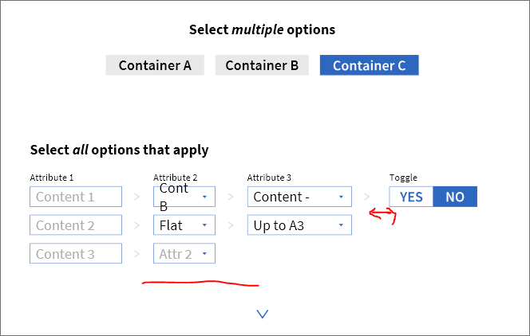
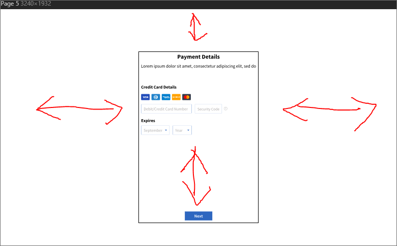
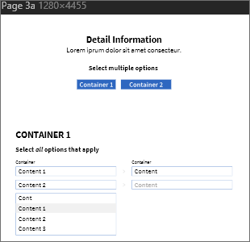
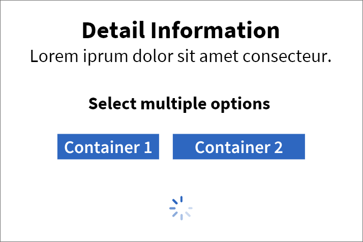

# [URGENT] Pixel perfect HTML/CSS from Sketch file

Are you asking for Mac using freelancers only by providing the sketch in a proprietary format; OS X having the market share of **17%** (desktop operating systems, worldwide, according [StatCounter](https://gs.statcounter.com/os-market-share/desktop/worldwide))?

So… [Here's](https://icons8.com/articles/how-to-open-sketch-file-on-windows/) the question: how to open `.sketch` file on Windows?

> **Sketch App**  
> Sketch is a Mac App. But you don’t have a Mac. You only have Windows, and this damned Sketch file someone sent you. And that someone had a Mac. But you don’t have a Mac.
>
> What are you going to do? Buy a Mac? Too expensive. Ask that *someone* to use Photoshop? No way, that *someone* is obsessed with Sketch. You're in a hopeless jam. Or so you thought…
>
> **Sketch for Windows**  
> You need [Sketch for Windows](https://icons8.com/lunacy). There is no Sketch for Windows.

## Description

> I'd like to get this done within the next few hours. Immediate hire!

Please explain in detail, what 'immediate hire' means to you; having **15** to **20** proposals on a job posted **4** hours ago, **9** of them in the interviewing state, **1** hire and still being open to proposals. 

> We'd like to get a pixel-perfect HTML/CSS with a high quality code

Please explain in detail: your constraints on the [cost-time-scope-triangle](https://en.wikipedia.org/wiki/Project_management_triangle) - **6+** forms within the next few hours for **$75**, asking for *pixel perfection* and *high quality code*.

Do you call this *high quality sketch*,

to be the base for the *high quality code* in question.

> with the attached sketch file.

Are you asking for attaching the `.sketch` file, attached by you, to the *high quality code* (to be written in HTML and CSS)?

> The canvas in this sketch file is currently `3240px` in width, but we'd like to support for `1280px` in width and larger displays.

Are you asking for that much fixed whitespace, keeping the actual ratio, 

or the framed (by the black border) form area to be `1280px` wide?

Giving you following font sizes (might be ok for a half-blind target audience):

> For all displays larger than `1280px`, we need to simply add the margins left and right.

Meaning horizontal scrolling on displays below `1280px` width?

## Proposal

For the state being, before question clarification:

1. Clarify the questions.
2. Throw away the `.sketch` `file, blacklisting it's creator.
3. Don't reinvent the quadratic wheel, use a front-end framework / library / toolkit like [Bootstrap](https://getbootstrap.com), with minimal customization ([theming](https://getbootstrap.com/docs/4.4/getting-started/theming/) the primary colors, borders, typography, etc.).
4. Dismiss the actual hire following the opposite approach, writing the next big front-end framework (throw-away number 1,000,000) within few hours.
5. By me a beer, or say thank you at least.