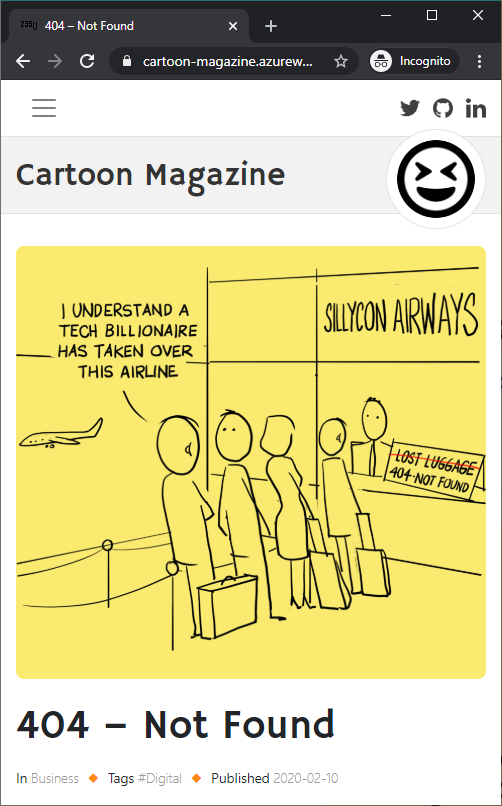

# Publishing a digital/mobile fist management cartoon magazine

See [job details](docs/job-details.pdf) (ongoing project project, fixed-price), as posted on February 24, 2020 within `Mobile Design`, including following images [cropped and renamed] posted as attachments,

- [Not Found](docs/not-found.jpg)
- [Russian Intelligence HQ](docs/russian-intelligence-hq.jpg)
- [Social Media Marketing](docs/social-media-marketing.jpg)

asking for expertise in `Mobile UI Design`, `User Experienmce Design`, and `Visual Design`, having a 24% hire rate and $300+ total spent since 2013.

## Solution

Live at https://cartoon-magazine.azurewebsites.net, [administration area](https://cartoon-magazine.azurewebsites.net/manager) credentials are `admin` / `password`.

