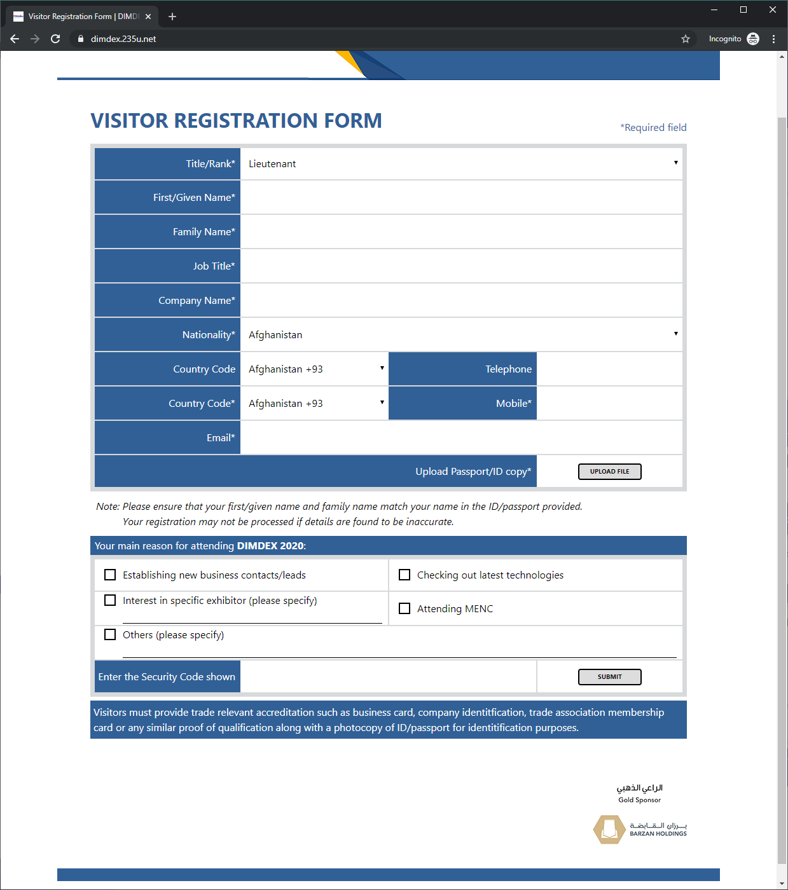

# DIMDEX Registration

## Requirements

See [Requirements.pdf](Requirements.pdf) for complete job description (one-time project, fixed price).

> to create high standard form

Run [Mozilla's Observatory](https://observatory.mozilla.org/analyze/dimdex.235u.net) analysis.

> according to design provided

[...]

> to be fast

Run [Google's PageSpeed Insights](https://developers.google.com/speed/pagespeed/insights/?url=https%3A%2F%2Fdimdex.235u.net%2F&tab=desktop) analysis.