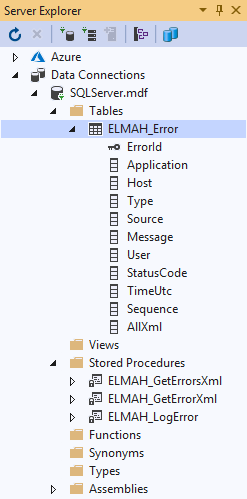

# ELMAH Configuration

Live at https://elmahconfiguration.azurewebsites.net, using `SQLite` for data persistence in `Release` configuration (for hosting in Azure), and `SqlServer` in default configuration for (local testing).

## Procedure

1. Add [Elmah.Mvc](https://github.com/alexbeletsky/elmah-mvc) via [NuGet](https://www.nuget.org/packages/Elmah.MVC/) to the host web application.
2. Set the [ErrorLog implementation](https://elmah.github.io/a/error-log-implementations/) to `Elmah.SqlErrorLog` in the `Web.config` of the host web application and provide the name of the `ConnectionString` to use.

```xml
<elmah>
    <errorLog type="Elmah.SqlErrorLog, Elmah" connectionStringName="elmah" />
</elmah>
```

3. Define the `ConnectionString` if not done yet.

```xml
<connectionStrings>
    <add name="elmah" connectionString="Data Source=(LocalDB)\MSSQLLocalDB;AttachDbFilename=|DataDirectory|\SQLServer.mdf;Integrated Security=True" />
</connectionStrings>
```

4. Update your database schema via [SQLServer.sql]() (original [source](https://github.com/elmah/SqlErrorLog)).



5. Produce errors.
6. Navigate to `/elmah`.

```csharp
public class HomeController : Controller
{
    public ActionResult Index()
    {
        RaiseErrorSignal();
        return RedirectToAction(actionName: "Index", controllerName: "elmah");
    }

    private static void RaiseErrorSignal()
    {
        try
        {
            throw new Exception(message: "Catch Me If You Can");
        }
        catch (Exception e)
        {
            ErrorSignal.FromCurrentContext().Raise(e);
        }
    }
}
```