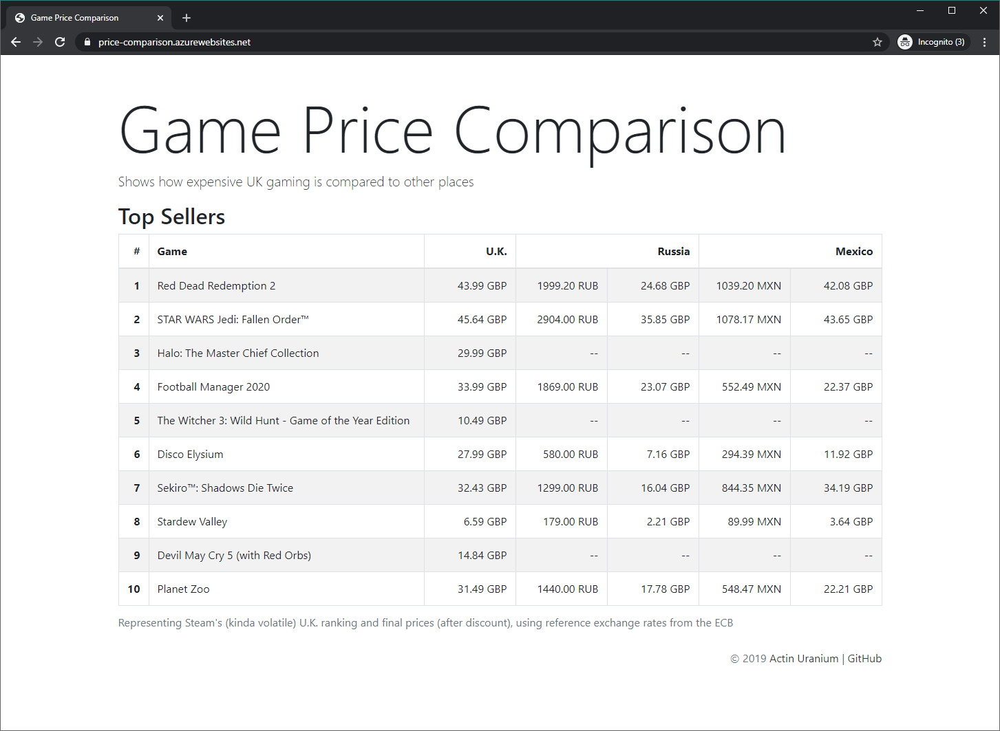

# Simple Steam game price comparison web tool using API

See [job details](docs/job-details.pdf) (one-time project, fixed price), as posted on December 20, 2019, within `Full Stack Development`, asking for expertise in `HTML`, `JavaScript`, `JSON API`.

## Description

> The idea is to provide data so that it can be used to publish on a news website

It sounds like a one-way ticket (aka throw-away application). How much data do you want to provide? And how often?

Once, for a single article?

Always, like the short stock market overview in the navigations bars of The New York Times [landing page](https://www.nytimes.com) and the [business section](https://www.nytimes.com/section/business), and/or the [full market overview](https://markets.on.nytimes.com/research/markets/overview/overview.asp)?

Data in which form? Via aditional JSON web API, as a facade, mashing up multiple APIs, aggregating the data?

> to show how expensive UK gaming is compared to other places.

That's the ultimate goal? Representing a hypothesis (to be proven right or wrong by real-world data analysis), or the conclusion (being quite obvious when comparing the United Kingdom with Sierra Leone, e.g.)?

> The data will be pulled using https://steamapi.xpaw.me/

The data won't be pulled from a third-party "static page that is automatically generated from" an [endpoint](https://partner.steamgames.com/doc/webapi/ISteamWebAPIUtil#GetSupportedAPIList) of the [Steamwork Web API](https://partner.steamgames.com/doc/webapi_overview), which "is [also] used to build this [official] documentation".

Memo: https://xpaw.me/ is beautiful.

> I need a basic webpage tool to populate current prices of steam games in Uk, Russia and Argentina

Note that this functionality is not part of the official API, see:

- Stackoverflow, [How to get the price of an app in Steam WebAPI?](https://stackoverflow.com/questions/13784059/how-to-get-the-price-of-an-app-in-steam-webapi)
- Official Team Fortress Wiki, [Rough documentation for the storefront API](https://wiki.teamfortress.com/wiki/User:RJackson/StorefrontAPI#Known_methods) - exposed via [Big Picture mode](https://support.steampowered.com/kb_article.php?ref=5006-ASLN-3202&l=english).

Do you need the current prices of all the games available on Steam? That's more than **80K**  titles (see [app-list.json](docs/app-list.json), returned by the [GetAppList](https://partner.steamgames.com/doc/webapi/ISteamApps#GetAppList) endpoint and taking 5+ MiB), being mutable (chaning its properties, e.g. titles, discounts).

Note that

- every title requires at least one additional request for pricing;
- the officially unsupported API as the officially supported public API might be limited to `n` requests per unit of time. 

See [official documentation](https://partner.steamgames.com/doc/webapi_overview#2):

> If you're a publisher, then Steam also provides a partner-only Web API server hosted at https://partner.steam-api.com. The intent of this service is to have higher availability than the public host […]
 
Also note that

- every title has an initial price and often one discount price (e.g. 20% off), the latter mutating over time, various packages/bundles and DLCs not considered;
- some titles (e.g. specific editions) are not available in some countries (for sale on Steam).

> and something to show which country has the cheapest price for the games.

Something like highlighting the cheapest price for a specific title? Something to be expressend in concrete numbers and/or graphically using charts? 

Note that prices are given in different currencies, which can be converted to one base currency (e.g. pound sterling) for comparison, nominally, ignoring the [purchasing power parity](https://en.wikipedia.org/wiki/Purchasing_power_parity) (PPP) and cultural specifics (like fundamental resistance against copyright).

Also note that initial prices (being the final prices on launch, sometimes, considering early access prices etc.) try to match locally specific price ranges (psychological barriers), pretty-printed as 1199.00 or 29.99, e.g., being broken by conversion (and discounts in whole numbers as well).

This may sound trivial, but "cheap" is a vague, highly subjective characteristic, in comparison with the less subjective "high price-performance ratio" (according to the "I'm not rich enough to buy cheap things" proverb).

> Some basic filters should be added also.

Please explain how these "basic filters" are supposed

> to show how expensive UK gaming is compared to other places.

Keep in mind that the ability to filter on game title requires all game titles (available in English, bound to the unique `appid`) to be prefetched. 

## Proof of concept

Live at https://price-comparison.azurewebsites.net,

taking about 2 seconds to load, without any optimizations (12 requests to 3 different APIs, on the back-end, in sequence, without caching, etc.)

Price conversions are done using [reference exchange rates](https://www.ecb.europa.eu/stats/policy_and_exchange_rates/euro_reference_exchange_rates) from the ECB (European Central Bank), not available for argentine pesos (replacing Argentina with Mexico, using mexican pesos).

## Proposal

1. Review the prototype and read the documentation (being not that "simple").
2. Hire, approve the first milestone ("Proof of concept").

> I can provide further details as required

1. Provide ALL the details you can.
2. Clarify the given questions.
3. Negotiate the next milestones, based on further proposals and indefinite estimates.
4. …
5. Redistribute the functionality between back- and front-end, targeting a JavaScript-only solution (for client-side execution)?

## Backlog

A breakdown of additional work to be done, in form of an **un**ordered list of requirements: 

- refactor.