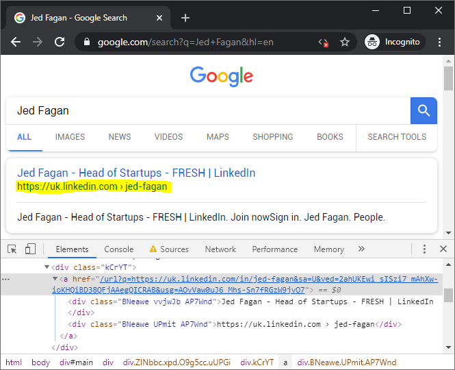

# Google Search

See [job details](docs/job-details.pdf) (one-time project, fixed-price), as posted on December 16, 2019, including input-output [samples](docs/example.xlsx), posted as an attachment.

## Description

> We need someone

The royal we (see [The Big Lebowski](https://www.imdb.com/title/tt0118715), [Bunch of Amateurs](https://youtu.be/dQbpx5Be5rI) and [She Kidnapped Herself](https://youtu.be/VLR_TDO0FTg) scenes)?
 
> to write a script

In wich scripting language (JavaScript, Perl, PHP, PowerShell, Python, Ruby, etc.)? For wich envirnoment; for client- or server-side execution? To be called 'data collection script'?

> that allows us to upload a CSV with a column of queries

Upload to a (web) server? Uploading manually by the end-user, using the browser (or something else)? Or automatically, by the script itself? A text file with queries as comma-separated values (newline-separated values for single-column text files, exactly speaking)?

```
Jed Fagan
Zeev Fisher
Tali Fisher
```

> and it needs to search google

It needs Google (it's web search engine) to search the (world wide) web? 

> and return the first and second result for each query.

Whom? The end-user, on CSV file upload? In which form?

> Please see the example attached.

As an Excel file (in XLSX format)?

## Assumptions

The 'script' is to be called 'Data collection script', as job's title; data being web links, according provided [Upwork example.xlsx](docs/example.xlsx), from Google Web Search results (see https://www.google.com/search?q=Jed+Fagan&hl=en with JavaScript disabled):


