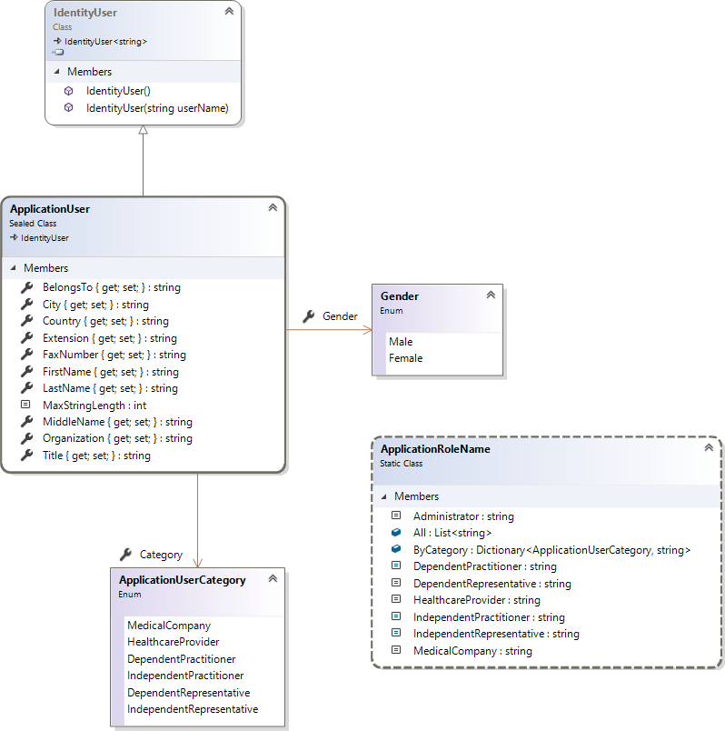

# Identity Customization

Feature-complete under made assumptions (listed below), according provided [Requirements.pdf](Requirements.pdf),

- as an `ASP.NET Core 3.0` web application (most actual at the moment of writing), 
- live at https://identitycustomization.azurewebsites.net, 
- running within the [Free App Service Plan](https://azure.microsoft.com/en-us/pricing/details/app-service/plans/) in West Europe without the `Always On` feature available (therefore taking time for the first request when in sleep mode),
- using `SQLite` for data persistence (via corresponding [EF Core Database Provider](https://docs.microsoft.com/en-us/ef/core/providers/sqlite).

Switch to SQL Server in [Startup.cs](IdentityCustomization/Startup.cs) for local testing using the preconfigured LocalDb connection string. Customize the connection string in [appsetings.json](IdentityCustomization/appsettings.json) for production environment.

## State

[](https://identitycustomization.azurewebsites.net)

## Design

### Data


### Models



### Services


## Login

Login by (mobile) phone number not implemented as unusual / confusing (keeping it simple - you aren't gonna need it).


## Two-Factor Authentication


2FA implemented using TOTP, as

> Two factor authentication (2FA) authenticator apps, using a Time-based One-time Password Algorithm (TOTP), are the industry recommended approach for 2FA. 2FA using TOTP is preferred to SMS 2FA.

However, [Twilio's SMS](https://www.twilio.com/sms) service is integrated (see [SmsSenderOptions](IdentityCustomization/Services/SmsSenderOptions.cs), [SmsSender](IdentityCustomization/Services/SmsSender.cs), and [SmsSenderTests](IdentityCustomization.Tests/Services/SmsSenderTests.cs)).

## Registration


### Issues

- `FirstName` instead of `Firstname`;
- `Middle name` should not be required (for multi-cultural personal names);
- `Title` dropdown values not provided;
- `Tel` is already available as `PhoneNumber` (see the `AspUsers` table / default `IdentityUser<TKey>` [implementation](https://docs.microsoft.com/en-us/dotnet/api/microsoft.aspnetcore.identity.entityframeworkcore.identityuser)); phone number confirmation not implemented (not required);
- `FaxNumber` instead of `Fax` (consistent with `PhoneNumber`);
- `Extension` field is confusing (what for / does it extend);
- `City` dropdown values not provided;
- `Country` dropdown values not provided;
- `Belongs to` dropdown values not provided; field name spelling and casing (`BelongsTo` instead of `Belongto`).

### Notes

- Organizations usually dont have first name, middle name, last name, title, and have neuter gender (ignored);
- all new fields decorated with the [PersonalData](https://docs.microsoft.com/en-us/dotnet/api/microsoft.aspnetcore.identity.personaldataattribute) attribute (see [Add custom user data to the Identity DB](https://docs.microsoft.com/en-us/aspnet/core/security/authentication/add-user-data) for details);
- maximum length of the text fields set to `64` characters (via [MaxLength](https://docs.microsoft.com/en-us/dotnet/api/system.componentmodel.dataannotations.maxlengthattribute) attribute).

### Notifications

Email notifications using [Twilio SendGrid](https://www.twilio.com/sendgrid) (see [EmailSenderOptions](IdentityCustomization/Services/EmailSenderOptions.cs), [EmailSender](IdentityCustomization/Services/EmailSender.cs), and [EmailSenderTests](IdentityCustomization.Tests/Services/EmailSenderTests.cs)).


## Categories

`Enum` instead of table (see [ApplicationUserCategory.cs](IdentityCustomization/Models/ApplicationUserCategory.cs)), ignoring `id` and `BSMCode` fields (purpose unclear):
```csharp
public enum ApplicationUserCategory
{
    [Display(Name = "Medical Sales/Marketing Company")]
    MedicalCompany,

    [Display(Name = "Healthcare Provider")]
    HealthcareProvider,
        
    [Display(Name = "Dependent Practitioner")]
    DependentPractitioner,

    [Display(Name = "Independent Practitioner")]
    IndependentPractitioner,

    [Display(Name = "Dependent Medical Sales/Marketing Representative")]
    DependentRepresentative,

    [Display(Name = "Independent Medical Sales/Marketing Representative")]
    IndependentRepresentative
}
```

## Roles

`RoleCode` and `CreationDate` fields ignored (purpose unclear; use already existing `Id`, `NormalizedName`, and `ConcurrencyStamp` fields instead).

### Naming

- `MedicalCompany` instead of `MedicalCompanyAdmin`;
- `HealthcareProvider` instead of `HealthcareProviderAdmin`;
- `DependentPractitioner` instead of `DependentPractitionorUser`;
- `IndependentPractitioner` instead of `InDependentPractitioner`;
- `DependentRepresentative` instead of `DependentRepresentativeUser`;
- `IndependentRepresentative` instead of `InDependentRepresentativeUser`;

## Pages


Implemented as [HomeController](IdentityCustomization/Controllers/HomeController.cs) views for simplified routing,

```csharp
public async Task<IActionResult> Index()
{
    ApplicationUser user = await _userManager.GetUserAsync(User);
    switch (user.Category)
    {
        case ApplicationUserCategory.MedicalCompany:
            return RedirectToAction(nameof(MedicalCompany));

        case ApplicationUserCategory.HealthcareProvider:
            return RedirectToAction(nameof(HealthcareProvider));

        case ApplicationUserCategory.DependentPractitioner:
            return RedirectToAction(nameof(DependentPractitioner));

        case ApplicationUserCategory.IndependentPractitioner:
            return RedirectToAction(nameof(IndependentPractitioner));

        case ApplicationUserCategory.DependentRepresentative:
            return RedirectToAction(nameof(DependentRepresentative));

        case ApplicationUserCategory.IndependentRepresentative:
            return RedirectToAction(nameof(IndependentRepresentative));

        default:
            return RedirectToAction(nameof(Error));
    }
}
```

and role based authorization configuration in one single place:

```csharp
[Authorize(Roles = ApplicationRoleName.MedicalCompany)]
public ViewResult MedicalCompany()
{
    return View();
}

[Authorize(Roles = ApplicationRoleName.HealthcareProvider)]
public ViewResult HealthcareProvider()
{
    return View();
}

[Authorize(Roles = ApplicationRoleName.DependentPractitioner)]
public ViewResult DependentPractitioner()
{
    return View();
}

[Authorize(Roles = ApplicationRoleName.IndependentPractitioner)]
public ViewResult IndependentPractitioner()
{
    return View();
}

[Authorize(Roles = ApplicationRoleName.DependentRepresentative)]
public ViewResult DependentRepresentative()
{
    return View();
}

[Authorize(Roles = ApplicationRoleName.IndependentRepresentative)]
public ViewResult IndependentRepresentative()
{
    return View();
}
```

### Naming

- `MedicalCompany.cshtml` instead of `CompanyAdmin Index.cshtml`;
- `HealthcareProvider.cshtml` instead of `HealthcareProviderAdminIndex.cshtml`;
- `DependentPractitioner.cshtml` instead of `DPractitionerIndex.cshtml`;
- `IndependentPractitioner.cshtml` instead of `IDPractitionerIndex.cshtml`;
- `DependentRepresentative.cshtml` instead of `DRepresentativeIndex.cshtml`;
- `IndependentRepresentative.cshtml` instead of `IDRepresentativeIndex.cshtml`;

