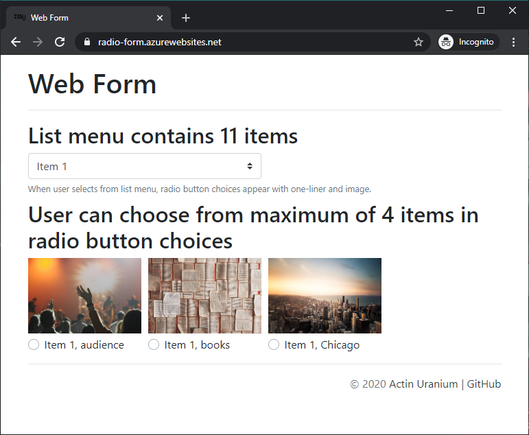

# Developer needed to code a web form

See [job details](docs/job-details.pdf) (one-time project, fixed-price), as posted on February 14, 2020 within `Front-End Development`, asking for expertise in `JavaScript`, `HTML` and `CSS3`.

## Client's recent history

Funny one:

> Extremely bad and rude client.....He will never talk to you properly.....his requirement and unclear.....beware he will try to trick you in may ways to get more work done from you maybe by offering new job when current one is completed.....he will never respect your work even after they keep giving you tons of changes.....HE IS A THIEF AND WILL MAKE YOU WORK LIKE A LABOUR OR KEEP THREATENING. they have no clear requirement...often changing requirement...will stop responding for weeks and will expect you to work moment they send details regardless to fact they were away for 2 months without any communication....long story short don't work with him...HE IS THE WORST CLIENT I HAVE WORKED WITH.

## Working solution

Live at: https://radio-form.azurewebsites.net

