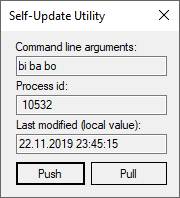

# Self-Update Utility

## Requirements

See [Requirements.pdf](Requirements.pdf) for complete job description (one-time project, fixed-price), formatting adjusted:

> I need to write a class in c# that will self update an application and restart it.
>
> You just need to complete the class bellow and write a simple form testing app with 2 buttons that will call the methods:
```
public class SelfUpdate
{
    // the list should come from .config file
    string files2update = "somefile.dll,someotherfile.txt";

    public void UploadLatestFiles()
    {
        /* 
         * this should ZIP the latest .exe and .config plus files in files2update and 
         * upload it to S3 bucket
         * also upload a small file called "lastmodified.txt" with a current timestamp
         */
    }

    public void SelfUpdate()
    {
        /*
         * THIS SHOULD UPDATE THE APP AND RESTART IT:
         * check the lastmodified.txt on S3 and 
         * if it's different from the current one
         * then download the ZIP file,
         * rename currently running exe to appname.old.exe and 
         * unzip it overwriting the old files            
         * then it should start a new process exactly as currently running one and 
         * exit currently running process
         * the exe name and command line arguments for the new process should be copied from current process.
         * Keep in mind it should work in MONO too.
         */
    }
}
```

## Solution

Top-level components:

- Class Library (.NET Standard 2.0)
- Windows Forms Test Application (.NET Framework 4.7.2)

This break-down helps testing the required functionality like overwriting of application's components at run-time (libraries being in use), whithout an interims application for updating of the target application (by stopping - overwriting - re-starting).

### User Interface

> write a simple form testing app with 2 buttons




### Minor Adjustments

Using `/` instead of `,` in

```xml
<setting name="FilesToUpdate" serializeAs="String">
    <value>SelfUpdateUtility.Library.dll/SomeOtherFile.txt</value>
</setting>
```

as comma could be part of a file name, while forward slash can not.

> also upload a small file called "lastmodified.txt" with a current timestamp

The upload-latest-files function 

```csharp
public async Task Push()
{
    await UploadLatestFiles();
    await UpdateLocalTimestamp();
}
```

requests the `LastModified` property of the currently uploaded archive (without [locking](https://docs.aws.amazon.com/AmazonS3/latest/dev/object-lock-overview.html))

```csharp
private async Task UpdateLocalTimestamp()
{
    GetObjectMetadataResponse metadata = await Client.GetObjectMetadataAsync(BucketName, BucketObjectKey);
    LocalTimestamp.SetUtcDateTime(metadata.LastModified);
}
```

and stores this timestamp locally, in the current working directory of the application:

```csharp
public static class LocalTimestamp
{
    private const string Path = "LastModified.txt";

    public static DateTime? GetUtcDateTime()
    {
        if (!File.Exists(Path))
        {
            return null;
        }

        string text = File.ReadAllText(Path);
        var timestamp = DateTimeOffset.Parse(text);
        return timestamp.DateTime;
    }

    public static void SetUtcDateTime(DateTime value)
    {
        Debug.Assert(value.Kind == DateTimeKind.Utc);
        var timestamp = new DateTimeOffset(value);
        var text = timestamp.ToString();
        File.WriteAllText(Path, text);
    }
}
```

The self-update function does not close it's host application instance, it has to be done by the host application itself:

```csharp
public async Task Pull()
{
    using (GetObjectResponse response = await Client.GetObjectAsync(BucketName, BucketObjectKey))
    {
        RenameCurrentProcessFileName();
        UpdateLocalFiles(response);
    }

    Process.Start(StartInfo);
}
```
The final implementation will vary depending on the host application type (e.g. by calling the [Close](https://docs.microsoft.com/en-us/dotnet/api/system.windows.forms.form.close?view=netframework-4.7.2) method on the main window or [Application.Exit](https://docs.microsoft.com/en-us/dotnet/api/system.windows.forms.application.exit?view=netframework-4.7.2) in a Windows Forms application, not available for console applications).

```csharp
private async void OnPullButtonClick(object sender, EventArgs e)
{
    try
    {
        if (await SelfUpdate.IsUpToDate())
        {
            MessageBox.Show(
                "The application is up to date.",
                MessageBoxCaption.Information,
                MessageBoxButtons.OK,
                MessageBoxIcon.Information);
        }
        else
        {
            Cursor.Current = Cursors.WaitCursor;
            await SelfUpdate.Pull();
            Cursor.Current = Cursors.Default;
            Close();
        }
    }
    catch (Exception ex)
    {
        MessageBox.Show(ex.Message, MessageBoxCaption.Error, MessageBoxButtons.OK, MessageBoxIcon.Error);
    }
}
```
The version check is done explicitly (extracted from the self-update function), to provide some feedback for the users:

```csharp
public async Task<bool> IsUpToDate()
{
    DateTime? remoteTimestamp = await GetLastModifiedAsync();
    if (!remoteTimestamp.HasValue)
    {
        return true;
    }
    else
    {
        DateTime? localTimestamp = LocalTimestamp.GetUtcDateTime();
        if (!localTimestamp.HasValue)
        {
            return false;
        }
        else
        {
            return localTimestamp >= remoteTimestamp;
        }
    }
}
```

> the exe name and command line arguments for the new process should be copied from current process.

The command line arguments get passed from the `Main` function of the host application:

```csharp
public static void Main(string[] args)
{            
    Application.EnableVisualStyles();
    Application.SetCompatibleTextRenderingDefault(false);
            
    try
    {
        using (AmazonS3Client client = CreateClient())
        {
            ProcessStartInfo startInfo = CreateStartInfo(args);
            var form = new MainForm(args)
            {
                SelfUpdate = new SelfUpdate
                {
                    Client = client,
                    StartInfo = startInfo,
                    FilesToUpdate = GetFilesToUpdate()
                }
            };

            Application.Run(form);
        }
    }
    catch (Exception ex)
    {
        MessageBox.Show(ex.Message, MessageBoxCaption.Error, MessageBoxButtons.OK, MessageBoxIcon.Error);
    }
}
```

The determination of the command line arguments passed to a specific process on later stages (at run-time), would depend on the host platform (i.e. different implementartions for Linux, macOS, and Windows).

### Final Steps

> upload it to S3 bucket

```csharp
private const string BucketName = "self-update-utility";
private const string BucketObjectKey = "SelfUpdateUtility.zip";
```

Adjust [Amazon S3 authentification](https://docs.aws.amazon.com/AmazonS3/latest/dev/MakingRequests.html) in your hosting application

```csharp
private static AmazonS3Client CreateClient()
{
    var credentials = GetCredentials();
    return new AmazonS3Client(credentials, RegionEndpoint.EUCentral1);
}

private static AWSCredentials GetCredentials()
{
    return new BasicAWSCredentials(
        accessKey: "[access key]",
        secretKey: "[secret key]");
}
```

and authorization via AWS Console according your scenario.

> should start a new process exactly as currently running one

Adjust [ProcessStartInfo](https://docs.microsoft.com/en-us/dotnet/api/system.diagnostics.processstartinfo?view=netstandard-2.0) configuration if required:

```csharp
private static ProcessStartInfo CreateStartInfo(string[] args)
{
    string fileName = GetCurrentProcessFileName();
    string arguments = string.Join(" ", args);
    return new ProcessStartInfo(fileName, arguments);
}

private static string GetCurrentProcessFileName()
{
    return AppDomain.CurrentDomain.FriendlyName;
}
```

### Issues

Getting a TrustFailure WebException with Mono 6.4.0.198 on Windows x64 ...

> Windows Mono builds don't currently support TLS 1.2

... according [this](https://github.com/mono/mono/issues/10489) (still open) GitHub issue, being recommended by Amazon (see [Infrastructure Security in Amazon S3](https://docs.aws.amazon.com/AmazonS3/latest/dev/network-isolation.html)).