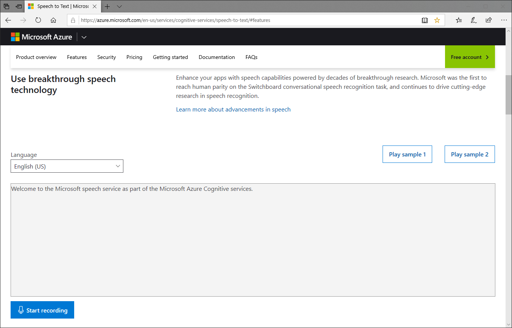
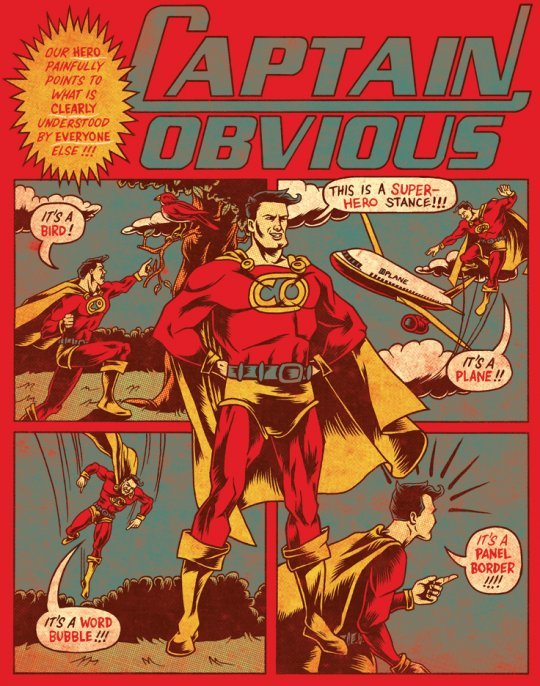
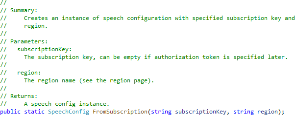
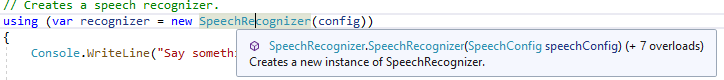

# Build Azure Speech to Text JavaScript C# proof of concept

See [job details](docs/job-details.pdf) (one-timme project project, fixed-price), as posted / renewed on February 27, 2020 within `Front-End Development`, looking for a mix of experience and value in `JavaScript`, `C#`, and `Azure Cognitive Speech to Text`.

## Asked questions

### Do you have any questions about the job description?

Why did you place this job within `Front-End Development`?


> Review code with me.

Do you mean explaining the code to you? (This might take a while, depending on your coding experience.)

> Would like it delivered in around two weeks.

Meaning April 13, 2020?

> There will be a bonus provided for early delivery and exceptional work.

What bonus? What does "early delivery" mean to you (having a vague time frame of around two weeks)? Can you diffentiate between "exceptional" and ordinary work? (Do you have the asked skills yourself?)

### What past project or job have you had that is most like this one and why?

I've had a small project in reverse order (text-to-speech), using Microsoft technologies (via `C#` / `PInvoke`), years before Azure though.

### What questions do you have about the project?

Could you explain the purpose of this project? Which concept do you want to proof exactly?

If you want to test the service, to verify its accuracy / quality yourself, see the [official demo](https://azure.microsoft.com/en-us/services/cognitive-services/speech-to-text/#features) (using Microsoft Edge browser; I wasn't lucky with Google Chrome):



Please note that there is no need in multiple text boxes / areas (for the requested "chunk" / "batch" modes).

### Do you already have these skills, and if not, can you learn missing skills quickly?

Let my work speak for itself - see the [live demo](https://speech-to-text.azurewebsites.net).

## Technical notes

> Ensure proper security is used, where server side authentication token is passed to client, where it is not exposed in HTML (not using Hidden Field)

In order to secure the [keys](#keys) you should not pass them to the client, whether in `HTML` nor in `JavaScript`.

> Use ASP.NET Framework (not Core), C#, JavaScript and jQuery. (No Angular/React/etc.)

I'd like to use `(ASP).NET Core`, and I'd like to dispense with `jQuery`. I could downgrade to `(ASP).NET Framwork` / `WebForms` later / on hire.

> Thoroughly document code.

I'm going to provide extensive technical documentation for the project here, in `Markdown`, version controlled.

The [service](https://docs.microsoft.com/en-us/azure/cognitive-services/speech-service/speech-to-text), its [Speech SDK](https://docs.microsoft.com/en-us/azure/cognitive-services/speech-service/speech-sdk) / [REST API](https://docs.microsoft.com/en-us/azure/cognitive-services/speech-service/rest-speech-to-text) are documented very well; there won't be a lot of custom code to document (inline, in code, regarding self-explaining code).

See [this code sample](https://github.com/Azure-Samples/cognitive-services-speech-sdk/blob/master/quickstart/csharp/dotnetcore/from-microphone/helloworld/Program.cs) on GitHub:

```csharp
public static async Task RecognizeSpeechAsync()
{
    // Creates an instance of a speech config with specified subscription key and service region.
    // Replace with your own subscription key // and service region (e.g., "westus").
    var config = SpeechConfig.FromSubscription("YourSubscriptionKey", "YourServiceRegion");

    // Creates a speech recognizer.
    using (var recognizer = new SpeechRecognizer(config))
    {
        Console.WriteLine("Say something...");

        // Starts speech recognition, and returns after a single utterance is recognized. The end of a
        // single utterance is determined by listening for silence at the end or until a maximum of 15
        // seconds of audio is processed.  The task returns the recognition text as result. 
        // Note: Since RecognizeOnceAsync() returns only a single utterance, it is suitable only for single
        // shot recognition like command or query. 
        // For long-running multi-utterance recognition, use StartContinuousRecognitionAsync() instead.
        var result = await recognizer.RecognizeOnceAsync();

        // Checks result.
        if (result.Reason == ResultReason.RecognizedSpeech)
        {
            Console.WriteLine($"We recognized: {result.Text}");
        }
        else if (result.Reason == ResultReason.NoMatch)
        {
            Console.WriteLine($"NOMATCH: Speech could not be recognized.");
        }
        else if (result.Reason == ResultReason.Canceled)
        {
            var cancellation = CancellationDetails.FromResult(result);
            Console.WriteLine($"CANCELED: Reason={cancellation.Reason}");

            if (cancellation.Reason == CancellationReason.Error)
            {
                Console.WriteLine($"CANCELED: ErrorCode={cancellation.ErrorCode}");
                Console.WriteLine($"CANCELED: ErrorDetails={cancellation.ErrorDetails}");
                Console.WriteLine($"CANCELED: Did you update the subscription info?");
            }
        }
    }
}
```

Thank you,



Using Visual Studio 2019, [Go To Definition](https://docs.microsoft.com/en-us/visualstudio/ide/go-to-and-peek-definition?view=vs-2019) (**F12**):



Using [IntelliSense](https://docs.microsoft.com/en-us/visualstudio/ide/using-intellisense?view=vs-2019):



Using [View (Online) Help](https://docs.microsoft.com/en-us/dotnet/api/microsoft.cognitiveservices.speech.speechrecognizer.recognizeonceasync) (**F1**) on `RecognizeOnceAsync`. 

## Keys

Using [Option 1](https://docs.microsoft.com/en-us/azure/cognitive-services/speech-service/get-started#no-card) from [Try the Speech service for free](https://docs.microsoft.com/en-us/azure/cognitive-services/speech-service/get-started) to

> Immediately get **free trial** API keys without providing any credit card info (you need to have an existing Azure account). The **free trial** lasts 30 days and data is deleted at the end. This option is best for quick experimentation with the service.

which gives two API keys for the West US region.

## Demo

Live at https://speech-to-text.azurewebsites.net

## Status quo

- [ ] Provide step by step instructions for me to reproduce on my machine with my Azure account.
- [x] Use Visual Studio 2019.
- [x] Follow good coding standards.
- [x] Ensure proper security is used, where server side authentication token is passed to client, where it is not exposed in HTML (not using Hidden Field)
- [ ] Use ASP.NET Framework (not Core), C#, JavaScript and jQuery. (No Angular/React/etc.)
- [x] Webforms would be ideal, but can be any web page, such as MVC or just HTML page.
- [x] Have one client side text box display spoken text up to 60 seconds in "chunk" mode after "Speak" button is clicked.
- [x] Have other client side text box display spoken text once, "batch" mode, after spoken text is finished.
- [x] Demonstrate both REST side technology and Server side SDK technology.
- [x] Thoroughly document code.
- [ ] Review code with me.


