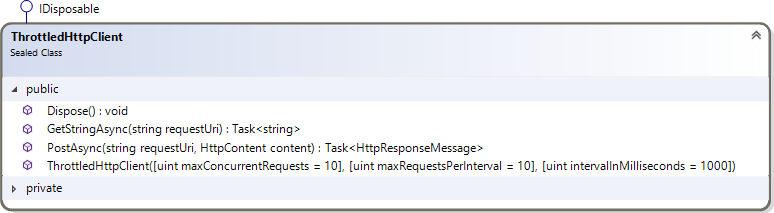
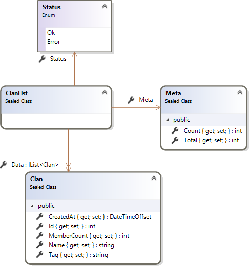

# .NET function to scrape JSON from site with throttling

See [job details](docs/job-details.pdf) (one-time project, fixed-price), as posted on January 1, 2020 within `Scripting and Automation`, from

> a VB.Net coder

asking for expertise in `C#`, `Data Scraping`, and `Web Crawler`, to deliver 

> a VB.net function - actual source code - that I can incorporate into my own Visual Studio project to reliably scrape the site.

## Do you have experience with bypassing mechanisms meant to prevent site scraping? 

To begin with, please note, that this might violate site's terms of use, see Upwork's [API Terms of Use](https://www.upwork.com/legal#api) for example:

> Developer and the Developer Application must not do the following:

[…]

> - Try to exceed or circumvent limitations on calls and use. This includes creating multiple Developer Applications for identical, or largely similar, purposes.
> - Download, scrape, post, or transmit, in any form or by any means, any part of the Site or Site Services, including data retrieved by web browser plugins.

[…]

> Except as provided in the API Terms, Developer may not copy or store any Upwork Content, or any information expressed by or representing Upwork Content (such as hashed or otherwise transformed data).

[…]

> Solely for the purpose of improving user experience, Developer may cache Upwork Content for no more than twenty-four (24) hours.

### Elaboration

See Microsoft, IIS, [Dynamic IP Security](https://docs.microsoft.com/en-us/iis/configuration/system.webserver/security/dynamicipsecurity/) (or any other web server/proxy/middleware documentation):

> Using dynamic IP restrictions means the administrator does not need to identify the IP addresses that need to be blocked. Instead, the administrator can configure the system so that it blocks any IP address that meets the set criteria. This can include blocking a remote client if the number of concurrent HTTP connection requests from that client exceeds a specific number, or blocking a client if the number of requests received over a period of time exceeds a specific number.

Circumvention of the IP-based protection, which is **not** part of this proposal, might be possible via 

- multiple instances of the scraper running at different IPs;
- paid proxy services like [Luminati](https://luminati.io/) or [oxylabs](https://oxylabs.io/);
- the volunteer overlay network from [The Tor Project](https://www.torproject.org/) (accessed via locally running web proxies).

Please keep in mind, that the public site in question (to be scraped) might be hosted on a weak server, unable to deliver expected response rates on its own, lacking physical hardware and network resources (being finite), to be shared between all the public (based on fair use).

## Proposal

Embrace the limitations, enqueue your requests and wait for them to finish (running in a background/web job; persisting/caching the results, eventually),



throttling on the client-side (scraper-/crawler-side; configuration values to find out experimentally).

### Proof of concept

Using [Wargaming.net API](https://developers.wargaming.net/documentation/guide/principles/), having limitations

> To provide the stable service functioning, the number of requests sent to API is limited.

like

> The limit is set on the number of requests sent from one IP address at the same time and in general equal to 10 requests per second.

Being 5 requests per second, actually, on the [https://api.worldoftanks.eu/wot/clans/list](https://developers.wargaming.net/reference/all/wot/clans/list/?r_realm=eu) endpoint, asking for



giving (with valid `application_id` provided) the [top-100 clans](docs/eu.clan-list.first-page.raw.json) (taking 98 KiB in JSON format).

Armed with the meta-data from the first response, make hundreds of calls (`C#` code [converted](http://converter.telerik.com/) to `VB.NET`),

```vb.net
<TestMethod>
Public Async Function GetClansConcurrently() As Task
    Dim tasks = New List(Of Task(Of String))()
    Dim allClans = New List(Of Clan)()

    Using client = New ThrottledHttpClient()
        Dim content As String = Await client.GetStringAsync(Url)
        Dim clanList = JsonSerializer.Deserialize(Of ClanList)(content, DeserializationOptions)
        allClans.AddRange(clanList.Data)

        Dim pageCount As Integer = GetPageCount(clanList.Meta)
        For page As Integer = 2 To pageCount
            Dim task As Task(Of String) = client.GetStringAsync(Url & $"&page_no={page}")
            tasks.Add(task)
        Next

        Dim results As String() = Await Task.WhenAll(tasks)
        For Each result As String In results
            clanList = JsonSerializer.Deserialize(Of ClanList)(content, DeserializationOptions)
            allClans.AddRange(clanList.Data)
        Next
    End Using

    Using stream = File.OpenWrite("eu.clan-list.final.json")
        Using writer = New Utf8JsonWriter(stream)
            Dim serializationOptions = New JsonSerializerOptions With {
                .PropertyNamingPolicy = JsonNamingPolicy.CamelCase
            }
            JsonSerializer.Serialize(writer, allClans, serializationOptions)
        End Using
    End Using
End Function
```

which gives ca. [100K clans](docs/eu.clan-list.final.json) (taking 10+ MiB in JSON format) within 3 minutes (5 requests per second).

