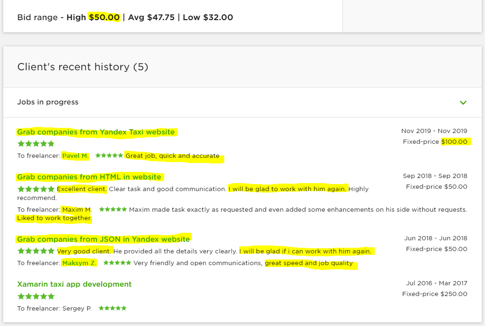

# Yandex.Taxi Scraper

See [job details](JobDetails.pdf) (one-time project, fixed-price), as posted on November 18, 2019.

## Proposal

See [proposal details](ProposalDetails.pdf), on client's terms (initial fixed-price budget), posted on the same day.

### Cover Letter

> Take a look at the output in the attachments; I hope it meets your expectations.
>
> On hire, my delivery will be a console application targeting .NET Core (can run on Windows, Linux and MacOS) and its source code (evt. hosted on GitHub); without any input arguments (hard-coded address and current HTML response structure), producing a single CSV file in its execution directory (the file in .xlsx-format is not part of this proposal, it was manually created, testwise, via Excel > New blank workbook > Data > From Text/CSV > File Origin: Unicode / UTF-8; Delimeter: Semicolon), without any extra error handling or data trimming / beautification.
>
> Note that any further customizations / adjustments are not part of this proposal, that any change requests will get billed extra (the specified budget is already hilarious, in my opinion / for my circumstances).

Including following attachments:

- [Yandex.Taxi.Companies.csv](Yandex.Taxi.Companies.csv)
- [Yandex.Taxi.Companies.xlsx](Yandex.Taxi.Companies.xlsx)

## Competition

Winning streak (see the in client's recent history in [job details](JobDetails.pdf) for this flawless hat-trick) on the same job posted thrice (Jun 2018 - Nov 2019), with freelancers glorifying the client in exactly the same terms, and client glorifying himself (great job!) in feedback to these freelancers:

Last one on twice the budget of the highest bid. That's the way we f***ing roll.